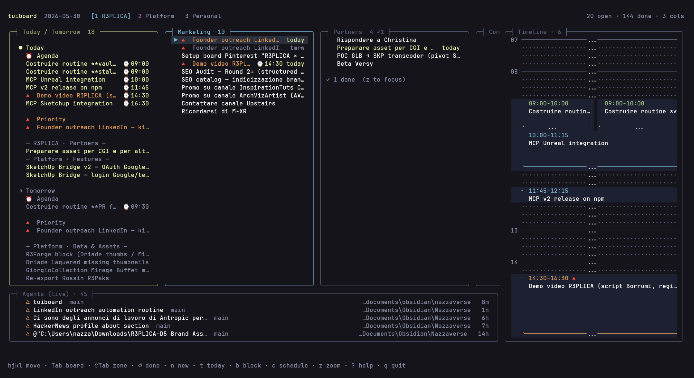

# tuiboard

A terminal dashboard that unifies **kanban**, a **Today/Tomorrow virtual
panel**, a **24-hour timeline**, and a **live agent view** for Claude Code
sessions — all on top of plain markdown task files.

Built with [OpenTUI](https://opentui.com) + SolidJS on Bun. Cross-platform
(Linux, macOS, Windows). No vendor lock-in: boards are CommonMark with
the Obsidian Tasks-plugin emoji vocabulary, so they open and edit fine in
any markdown editor.



## Install

Requires [Bun](https://bun.sh) ≥ 1.2 — tuiboard runs on the Bun runtime (it's
not a Node CLI). OpenTUI ships its own native renderer binaries; Bun picks the
right one for your platform automatically. Pick whichever install fits:

**Global, straight from GitHub** (no npm needed) — run `tuiboard` from anywhere:

```bash
bun install -g github:NazzarenoGiannelli/tuiboard
tuiboard
```

**Global, from npm** (once published):

```bash
bun install -g tuiboard      # or run once, no install: bunx tuiboard
```

**From source** (for hacking on it):

```bash
git clone https://github.com/NazzarenoGiannelli/tuiboard.git
cd tuiboard
bun install
bun run dev          # or: bun link  → then `tuiboard` globally, live-linked
```

## Quick start

Starting fresh — no Obsidian, no special folders required:

1. **Install Bun** ([bun.sh](https://bun.sh)), then `bun install -g tuiboard`.
2. **Make one or more board files.** A board is a plain `.md` file: every `##`
   heading is a column, every `- [ ]` line is a task. The simplest board:
   ```markdown
   ## To Do
   - [ ] My first task

   ## In Progress

   ## Done
   ```
   Create one file per tab you want (e.g. `Work.md`, `Personal.md`). Columns
   named exactly `Done` and `Archive` are treated specially (hidden from the
   board view but used by the done-stats and the archive action).
3. **Point tuiboard at them.** Create `~/.config/tuiboard/config.yaml` (found
   from any directory) with **absolute** paths:
   ```yaml
   boards:
     - path: /home/you/notes/Work.md
       name: Work
     - path: /home/you/notes/Personal.md
       name: Personal
   ```
   Or skip the config entirely and just run `tuiboard` inside a folder that
   already contains `.md` files with `- [ ]` tasks — it auto-discovers them.
4. **Run it:** `tuiboard` (or the short alias `tb`).

**The Agent view needs zero setup.** tuiboard reads your local Claude Code
sessions from `~/.claude/` automatically, so the live agent strip fills in as
soon as you've used Claude Code — nothing to connect or configure. (Tools that
don't write to `~/.claude`, like Codex, won't show up there.)

See [Configure](#configure) for assignees, the done/archive column names, and
the optional custom "open session in your terminal" command.

### Let an AI agent set it up for you

Paste this into **Claude Code** (or Codex / Cursor) from any directory — it
interviews you and wires everything up:

```text
I just installed `tuiboard` (a terminal kanban dashboard:
https://github.com/NazzarenoGiannelli/tuiboard). Set it up for me from scratch:

1. Ask me: (a) which directory should hold my board markdown files,
   (b) how many boards/tabs I want and their names (e.g. Work, Personal),
   (c) any assignee names I use.
2. Create one markdown file per board in that directory. Each file: a few `##`
   column headings — default `## To Do`, `## In Progress`, `## Done` — and no
   tasks yet. Always include a `## Done` column (tuiboard treats columns named
   `Done` and `Archive` specially and hides them from the board view).
3. Create a global config at `~/.config/tuiboard/config.yaml` (resolve the real
   home path) with a `boards:` list pointing at those files by ABSOLUTE path,
   plus `assignees: [...]`, `done_column: Done`, `archive_column: Archive`.
4. Do NOT configure the Agent view — tuiboard reads `~/.claude` automatically.
5. Ask me whether I want to overlay my Google Calendar or Microsoft 365 events
   on the Agenda. If yes, tell me to run `tuiboard calendar-setup google` (or
   `microsoft`) — it interviews me, opens the browser, and prints the exact
   `calendars:` YAML block to add. Don't try to do the OAuth yourself. If no,
   skip it (it's optional and can be added later).
6. Show me the final config, then tell me to run `tuiboard`, and how to add a
   board later (create a new `.md` and append it to the `boards:` list).

Confirm the directory and file names with me before writing any files.
```

## Configure

Copy `.tuiboard/config.example.yaml` to a config location and edit the
`boards:` list to point at your markdown files. tuiboard resolves the config
in this order (first hit wins):

1. **`$TUIBOARD_CONFIG`** — explicit path to a config file.
2. **Project-local** — `.tuiboard/config.yaml`, walking up from the cwd. Drop
   a `.tuiboard/` folder at a project/vault root and it's used whenever you
   launch from inside that tree.
3. **Global** — `~/.config/tuiboard/config.yaml` (or `~/.tuiboard/config.yaml`).
   Use **absolute** board paths here and `tuiboard` shows your boards from
   *any* directory — the usual setup for a single-vault user.
4. **Fallback** — scan the cwd for any `.md` file containing `- [ ]` tasks.

```yaml
boards:
  - path: ./Work.md
    name: Work
  - path: ./Personal.md
    name: Personal

assignees: [Alice, Bob]
done_column: Done
archive_column: Archive

# Optional: override Enter in the Agents zone. argv array, {cwd}/{sessionId}
# substituted, run directly (no shell — element 0 must be a real binary/abs
# path, NOT a shell builtin or Windows App Execution Alias). Defaults to
# opening a WezTerm tab with `claude --resume <id>`. For a custom layout:
# resume_command: ["nu", "C:/Users/you/.config/tuiboard/code-resume.nu", "{cwd}", "{sessionId}"]
```

## Calendars (Agenda overlay)

The **Agenda** zone (the 24h timeline) can overlay read-only events from Google
Calendar and Microsoft 365 alongside your time-blocked tasks — rendered as
colored `📅` blocks you can't edit, so the day's real shape is visible at a
glance. All-day events are skipped; each calendar keeps its own color. Events
are cached 30 min on disk and refreshed every 5 min. **Bring your own
credentials** — there's nothing to sign up for and nothing leaves your machine.

Connect a calendar with the built-in setup command:

```bash
tuiboard calendar-setup google      # opens your browser (read-only scope)
tuiboard calendar-setup microsoft   # device-code flow, no redirect
```

**Google** needs a one-time OAuth client (free): Google Cloud Console → enable
*Google Calendar API* → create an *OAuth client ID* (type **Desktop app**) →
download the JSON to `~/.config/tuiboard/google_credentials.json`, then run the
command above. **Microsoft** needs an Azure app registration (Public client,
`Calendars.Read` delegated) whose client ID goes in
`~/.config/tuiboard/azure_config.json` — running `calendar-setup microsoft` with
no config writes a template that walks you through it.

After connecting, the command prints the exact YAML to paste into your config:

```yaml
calendars:
  google:
    enabled: true
    token: ~/.config/tuiboard/google_token.json
  microsoft:
    enabled: true
    config: ~/.config/tuiboard/azure_config.json
    token_cache: ~/.config/tuiboard/ms_token.json
```

Paths support `~` and resolve against the config dir if relative. A missing,
expired, or unconfigured calendar never breaks the board — it just shows no
events. Set either provider's `enabled: false` (or drop the block) to turn it
off; add a `color:` to override the fallback block color.

## Markdown board format

`tuiboard` reads and writes **plain CommonMark** with the Obsidian
Tasks-plugin emoji vocabulary. Any markdown editor renders these files
sensibly; the Obsidian Kanban plugin renders them as a kanban; we render
them as a TUI.

### Minimal example

```markdown
---
kanban-plugin: board
---

## Today

- [ ] Fix auth flow @nazza ⏳ 2026-05-27 ⌚ 09:00-10:30 #pr-followup
- [x] Review PR #412 ✅ 2026-05-26

## In Progress

- [ ] Migrate timeline to OpenTUI @nazza

## Done
```

The `kanban-plugin: board` frontmatter is **optional** — it's only there so the
file also renders as a board in Obsidian's Kanban plugin. tuiboard itself needs
just the `##` column headings and `- [ ]` task lines.

### Metadata vocabulary

| Symbol | Meaning | Notes |
|---|---|---|
| `## Heading` | Column name | One column per H2 heading |
| `- [ ]` / `- [x]` | Task (open / done) | Standard markdown task list |
| `@name` | Assignee | Configurable list in config.yaml |
| `#tag` | Tag | Any hashtag; passed through verbatim |
| `⏳ YYYY-MM-DD` | Scheduled date | Tasks-plugin convention |
| `📅 YYYY-MM-DD` | Due date | Tasks-plugin convention |
| `🛫 YYYY-MM-DD` | Start date | Tasks-plugin convention |
| `✅ YYYY-MM-DD` | Done date | Tasks-plugin convention |
| `⌚ HH:MM-HH:MM` | Time block | tuiboard-specific (Tasks plugin has no time-of-day) |
| `🔺 ⏫ 🔼 🔽 ⏬` | Priority | Tasks-plugin convention |

Anything else stays in the task text untouched on write-back. Roundtrip is
byte-for-byte preserving when a task hasn't been edited; structured fields
are rebuilt only after an in-app mutation.

## Layouts

Launch `tuiboard` with no flag for the default 4-zone dashboard.

| Flag | View | Use case |
|---|---|---|
| (none) | **Dashboard** — all 4 zones | Default; everything in one terminal |
| `--view=board` | Kanban + virtual panel only | Focus mode, or a single WezTerm pane |
| `--view=timeline` | Timeline fullscreen | Wall-mounted "what's now" |
| `--view=agents` | Agent view fullscreen | Cross-machine session monitor |

The dashboard auto-collapses optional zones on narrow terminals:

| Terminal width | Default zones visible |
|---|---|
| ≥ 150 cols | virtual + board + timeline + agents |
| 120–149 | virtual + board + agents |
| 100–119 | virtual + board |
| < 100 | board only |

`F1` / `F2` / `F3` toggles override the auto-collapse for the current
session (until the next terminal resize).

## Keyboard

### Navigation

| Key | Action |
|---|---|
| `h j k l` / arrows | Move cursor inside the active zone |
| `Tab` | Cycle to next board |
| `1`..`9` | Jump to board N |
| `v` | Toggle Today/Tomorrow virtual panel focus |
| `Shift-Tab` | Cycle active zone (virtual → board → timeline → agents) |
| `F1` / `F2` / `F3` | Toggle visibility of Virtual / Timeline / Agents zones |
| `z` | Zoom active zone to full screen |
| `r` | Refresh everything — reload boards from disk, rescan agents, force-refetch the agenda calendar (bypasses the 30-min cache) |

### Agenda (timeline zone)

| Key | Action |
|---|---|
| `[` / `]` | Previous / next day — shows that day's tasks **and** calendar events (works from any zone) |
| `\` | Jump back to today |
| `c` | Arm mode: click a task, then click a slot to schedule (works from any zone) |
| `j` / `k` | While armed: nudge the block ±15 min |
| `+` / `-` | While armed: resize the block's end ±15 min |

### Task actions (work in board, virtual, AND timeline zones)

| Key | Action |
|---|---|
| `Enter` | Toggle done |
| `o` | Open detail view |
| `e` | Edit task text |
| `s` | Schedule date modal |
| `t` | Set scheduled = today |
| `m` | Set scheduled = tomorrow |
| `.` | Schedule **now** — time block at the next 15-min slot |
| `b` | Set time block modal |
| `p` | Cycle priority (none → 🔺 → ⏫ → 🔼 → 🔽 → ⏬ → none) |
| `a` | Set assignee |
| `c` | Toggle calendar **arm mode** — then click a task, click a timeline slot, repeat |
| `Shift-C` | Copy task to clipboard (markdown line — paste as context for Claude Code) |
| `d` | Delete task (with confirm) |
| `Shift-X` | Archive task → moves to Archive column |

### Multi-select

| Key | Action |
|---|---|
| `Space` | Mark / unmark task — task actions then apply to ALL marked |
| `Esc` | Clear marks (when no modal is open) |

### Board-only / bulk / global

| Key | Action |
|---|---|
| `n` | New task in current column (quick-add syntax) |
| `Shift-T` | Reset ALL overdue tasks (any board) to today |
| `Ctrl-Z` | Undo last mutation |
| `?` | Help modal with the full reference |
| `q` · `Ctrl-C` | Quit |

## Status

- **v0.6** — adds the Agenda calendar overlay (Google + Microsoft 365,
  read-only, BYO credentials) and day-navigation (`[` / `]` / `\`) so you can
  page tasks and events across days.
- **v0.5** — daily-driver ready. Kanban + virtual + timeline + agents
  all functional, multi-select, undo, atomic file roundtrip, mouse click,
  responsive layout. Tested on Windows with WezTerm; Linux/macOS should
  work via the same OpenTUI binaries (untested).

## License

MIT — see [LICENSE](LICENSE).
