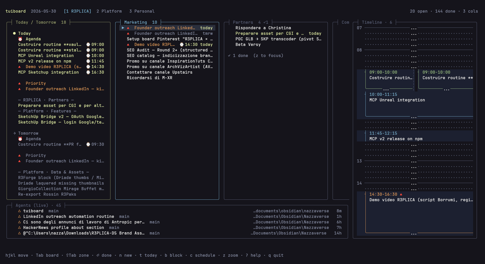

# tuiboard

A terminal **kanban** board on plain markdown files, with three optional panels
you switch on or off: a **Today/Tomorrow planner** across all your boards, a
**24-hour agenda** with a read-only Google / Microsoft 365 calendar overlay, and
a **live view of your coding-agent sessions** (Claude Code, Codex, OpenCode, Pi).
Run it as a pure kanban, or any mix
of the four. The board is always on; the rest is opt-in (see [Zones](#zones)).

Built with [OpenTUI](https://opentui.com) + SolidJS on Bun. Cross-platform
(Linux, macOS, Windows). No vendor lock-in: boards are CommonMark with
the Obsidian Tasks-plugin emoji vocabulary, so they open and edit fine in
any markdown editor.



## Install

Requires [Bun](https://bun.sh) ≥ 1.2 — tuiboard runs on the Bun runtime (it's
not a Node CLI). OpenTUI ships its own native renderer binaries; Bun picks the
right one for your platform automatically. Pick whichever install fits:

**Global, straight from GitHub** (no npm needed) — run `tuiboard` from anywhere:

```bash
bun install -g github:NazzarenoGiannelli/tuiboard
tuiboard
```

**Global, from npm:**

```bash
bun install -g tuiboard      # or run once, no install: bunx tuiboard
```

**From source** (for hacking on it):

```bash
git clone https://github.com/NazzarenoGiannelli/tuiboard.git
cd tuiboard
bun install
bun run dev          # or: bun link  → then `tuiboard` globally, live-linked
```

## Quick start

Starting fresh — no Obsidian, no special folders required:

1. **Install Bun** ([bun.sh](https://bun.sh)), then `bun install -g tuiboard`.
2. **Make one or more board files.** A board is a plain `.md` file: every `##`
   heading is a column, every `- [ ]` line is a task. The simplest board:
   ```markdown
   ## To Do
   - [ ] My first task

   ## In Progress

   ## Done
   ```
   Create one file per tab you want (e.g. `Work.md`, `Personal.md`). Columns
   named exactly `Done` and `Archive` are treated specially (hidden from the
   board view but used by the done-stats and the archive action).
3. **Point tuiboard at them.** Create `~/.config/tuiboard/config.yaml` (found
   from any directory) with **absolute** paths:
   ```yaml
   boards:
     - path: /home/you/notes/Work.md
       name: Work
     - path: /home/you/notes/Personal.md
       name: Personal
   ```
   Or skip the config entirely and just run `tuiboard` inside a folder that
   already contains `.md` files with `- [ ]` tasks — it auto-discovers them.
4. **Run it:** `tuiboard` (or the short alias `tb`).

**The Agent view needs zero setup.** tuiboard reads your local agent sessions
automatically, read-only — Claude Code from `~/.claude/`, Codex from
`~/.codex/` (respects `$CODEX_HOME`), OpenCode from
`~/.local/share/opencode/opencode.db` (respects `$XDG_DATA_HOME`), Pi from
`~/.pi/agent/sessions/` (respects `$PI_CODING_AGENT_DIR`,
`$PI_CODING_AGENT_SESSION_DIR` and `sessionDir`) — so the live agent strip
fills in as soon as you've used any of them, even if you start the agent after
tuiboard. Nothing to connect or configure. Codex, OpenCode and Pi keep no
record of running processes, so their sessions show as busy while a turn is in
progress (stale if a turn stops updating for 30 minutes), never as
idle-but-open.

Each session's state uses the same symbols as [herdr](https://herdr.dev):
`×` waiting for you, `◐` working, `✓` done, `○` idle, `·` closed, plus
tuiboard's own `△` for a turn that stopped updating (`status_indicators: dots`
switches to colored dots). **With herdr running**, tuiboard reads its live
state for every session open in a herdr pane — so "waiting for you", "done"
and "idle" show up for every agent, and a long Claude turn no longer turns
stale — and the zoomed cards say where each one lives (`herdr blits · tab 3`).
herdr reports the exact session when its agent integration is installed
(`herdr integration install claude|codex|opencode|pi`); otherwise tuiboard
matches by agent and directory. `H` jumps to a session in herdr — or resumes
it there, in a new tab of the workspace that holds its project — and Enter on
a session that's already open in herdr takes you to it instead of starting a
second copy.

Every session carries a colored two-letter harness badge — `cc` Claude Code,
`cx` Codex, `oc` OpenCode, `pi` Pi — plus the model it ran on. The dashboard strip keeps
one line per session (on a narrow row the model gives way first, then the
branch, then the directory); zoom the Agents zone (`z`) or run
`tuiboard --view=agents` for two-line cards with the model, branch and full
directory under each title. `f` in the Agents zone filters by harness.

See [Configure](#configure) for assignees, the done/archive column names, and
the optional custom "open session in your terminal" command.

### Let an AI agent set it up for you

Paste this into **Claude Code** (or Codex / Cursor) from any directory — it
interviews you and wires everything up:

```text
I just installed `tuiboard` (a terminal kanban dashboard:
https://github.com/NazzarenoGiannelli/tuiboard). Set it up for me from scratch:

1. Ask me: (a) which directory should hold my board markdown files,
   (b) how many boards/tabs I want and their names (e.g. Work, Personal),
   (c) any assignee names I use.
2. Create one markdown file per board in that directory. Each file: a few `##`
   column headings — default `## To Do`, `## In Progress`, `## Done` — and no
   tasks yet. Always include a `## Done` column (tuiboard treats columns named
   `Done` and `Archive` specially and hides them from the board view).
3. Create a global config at `~/.config/tuiboard/config.yaml` (resolve the real
   home path) with a `boards:` list pointing at those files by ABSOLUTE path,
   plus `assignees: [...]`, `done_column: Done`, `archive_column: Archive`.
4. Ask me which zones I want besides the kanban board: the Today/Tomorrow
   planner, the 24h agenda, and the live agent-sessions view (Claude Code,
   Codex, OpenCode, Pi). For any I don't want, add a `zones:` block setting it
   to `off` (e.g. someone who uses none of those agents would set
   `agents: off`). If I want them all, omit the block. Do NOT configure the
   agents view beyond on/off — it finds each agent's sessions automatically.
5. Ask me whether I want to overlay my Google Calendar or Microsoft 365 events
   on the Agenda (skip this if I turned the agenda off). If yes, tell me to run
   `tuiboard calendar-setup google` (or `microsoft`) — it interviews me, opens
   the browser, and prints the exact `calendars:` YAML block to add. Don't try
   to do the OAuth yourself. If no, skip it (it's optional and can be added later).
6. Show me the final config, then tell me to run `tuiboard`, and how to add a
   board later (create a new `.md` and append it to the `boards:` list).

Confirm the directory and file names with me before writing any files.
```

## First run

Launch `tuiboard` with nothing set up and it opens its own onboarding rather
than an error: point it at a folder and adopt the markdown files already in it,
or give a name and get a new board. Either way it writes the config for you and
opens the board. The same screen is behind the `+` in the top bar, so adding a
board later is the gesture you already learned.

New boards are created next to the boards you already have — usually a vault,
so they inherit whatever sync and versioning it has — falling back to
`~/.local/share/tuiboard/boards/` when there is nothing to learn from. The path
is always shown and editable before anything is written.

## Configure

Copy `.tuiboard/config.example.yaml` to a config location and edit the
`boards:` list to point at your markdown files. tuiboard resolves the config
in this order (first hit wins):

1. **`$TUIBOARD_CONFIG`** — explicit path to a config file.
2. **Project-local** — `.tuiboard/config.yaml`, walking up from the cwd. Drop
   a `.tuiboard/` folder at a project/vault root and it's used whenever you
   launch from inside that tree.
3. **Global** — `~/.config/tuiboard/config.yaml` (or `~/.tuiboard/config.yaml`).
   Use **absolute** board paths here and `tuiboard` shows your boards from
   *any* directory — the usual setup for a single-vault user.
4. **Fallback** — scan the cwd for any `.md` file containing `- [ ]` tasks.

```yaml
boards:
  - path: ./Work.md
    name: Work
  - path: ./Personal.md
    name: Personal

assignees: [Alice, Bob]
done_column: Done
archive_column: Archive

# Enter in the Agents zone opens the session in the terminal tuiboard runs in
# (tmux, herdr, WezTerm, Windows Terminal, Ghostty, else the OS default
# terminal; clipboard as last resort). Force one if detection guesses wrong:
# resume_terminal: windows-terminal   # auto (default) | tmux | herdr | wezterm |
#   ghostty | xdg-terminal-exec | windows-console | macos-terminal
# The session runs in your shell (auto: the one you started tuiboard from — Git
# Bash / Nushell / PowerShell on Windows, $SHELL elsewhere). Force one with:
# resume_shell: bash                  # auto | bash | zsh | fish | nu | pwsh | powershell | cmd

# Optional: replace Enter with your own launcher. argv array, {cwd}/{sessionId}/
# {resume} substituted, run directly (no shell — element 0 must be a real binary/abs
# path, NOT a shell builtin or Windows App Execution Alias). Takes precedence
# over resume_terminal. For a custom layout:
# resume_command: ["nu", "C:/Users/you/.config/tuiboard/code-resume.nu", "{cwd}", "{sessionId}"]

# Optional: the command `c` copies to the clipboard in the Agents zone — one
# paste that cd's into the session dir and resumes it, so you can open it
# yourself in any tab/pane (no WezTerm needed). {cwd}/{sessionId}/{resume}
# substituted. Default: 'cd "{cwd}" && {resume}'. Nushell users:
# copy_resume_command: 'cd "{cwd}"; {resume}'
```

## Zones

tuiboard is four zones — **board** (kanban), **planner** (Today/Tomorrow across
all boards), **agenda** (24h timeline + calendar overlay), and **agents** (live
coding-agent sessions). Only want some of them? The board is always on; the other
three are yours to configure:

```yaml
zones:
  planner: on      # Today/Tomorrow panel          (toggle at runtime with F1)
  agenda: on       # 24h agenda + calendars        (F2)
  agents: off      # live agent sessions view      (F3)
```

Each zone takes one of:

| Value | Behavior |
|---|---|
| `on` | Enabled and shown at launch (the default). |
| `off` | **Disabled entirely** — never rendered, skipped by `Shift-Tab`, its F-key is inert, and its background work never starts (no calendar fetch, no agent session reads). |
| `hidden` | Enabled but **collapsed at launch** — reveal it any time with its F-key. |

`true`/`false` work as aliases for `on`/`off`. So a pure kanban is just
`agenda: off` and `agents: off`; kanban + calendar is `agents: off`. The
difference between `off` and the F-key hide: `off` means the feature never runs
at all — handy if you use none of the supported agents and don't want
tuiboard reading their session stores.

## Calendars (Agenda overlay)

The **Agenda** zone (the 24h timeline) can overlay events from Google Calendar
and Microsoft 365 alongside your time-blocked tasks — timed events render as
colored `📅` blocks on the grid, and all-day events ride in a chip strip at the
top (like Google Calendar's all-day band). The day's real shape is visible at a
glance. Each calendar keeps its own color. Events are cached 30 min on disk and
refreshed every 5 min. **Bring your own credentials** — there's nothing to sign
up for and nothing leaves your machine. (Reading is the default; opt into
creating/editing events below.)

Connect a calendar with the built-in setup command:

```bash
tuiboard calendar-setup google      # opens your browser (read-only scope)
tuiboard calendar-setup microsoft   # device-code flow, no redirect
```

**Microsoft** needs an Azure app registration (Public client, `Calendars.Read`
delegated) whose client ID goes in `~/.config/tuiboard/azure_config.json` —
running `calendar-setup microsoft` with no config writes a template that walks
you through it.

#### Google: one-time OAuth client setup

There's no hosted tuiboard app — **you create your own free OAuth client** in
your own Google Cloud project, so nothing is shared and your data never passes
through anyone else's servers. It takes about five minutes, once:

1. Go to the [Google Cloud Console](https://console.cloud.google.com/) and
   create a project (or pick an existing one) from the project dropdown.
2. **APIs & Services → Library** → search **"Google Calendar API"** → **Enable**.
3. **APIs & Services → OAuth consent screen**: if prompted, choose **External**,
   give the app a name and your email, and save. You don't need to publish it or
   submit for verification — as the project owner you're automatically a test
   user of your own app, which is all tuiboard needs. (Add your Google address
   under **Test users** if it asks.)
4. **APIs & Services → Credentials → Create credentials → OAuth client ID**.
   Application type: **Desktop app**. Create.
5. **Download JSON** on the client you just made, and save it as
   `~/.config/tuiboard/google_credentials.json`.
6. Run `tuiboard calendar-setup google` (add `--write` to also create/edit/delete
   — see below). Your browser opens; approve the access. You'll briefly see an
   "unverified app" notice — that's expected for your own personal client; click
   **Advanced → go to (your app)** to continue. The token is saved and the
   command prints the YAML block to paste into your config.

The `calendar-setup` command prints these exact steps too if it doesn't find the
credentials file.

After connecting, the command prints the exact YAML to paste into your config:

```yaml
calendars:
  google:
    enabled: true
    token: ~/.config/tuiboard/google_token.json
  microsoft:
    enabled: true
    config: ~/.config/tuiboard/azure_config.json
    token_cache: ~/.config/tuiboard/ms_token.json
```

Paths support `~` and resolve against the config dir if relative. A missing,
expired, or unconfigured calendar never breaks the board — it just shows no
events. Set either provider's `enabled: false` (or drop the block) to turn it
off; add a `color:` to override the fallback block color.

### Creating, editing & deleting events (Google, opt-in)

Reading is the default. To also **create, edit, and delete** Google Calendar
events from the Agenda, re-authorize with the write scope:

```bash
tuiboard calendar-setup google --write
```

**Create** — in the Agenda zone, press **`n`** (or **click an empty time slot**)
to open the new-event modal: type a title, press Enter, pick the target calendar
with `j`/`k`, Enter to create. Only calendars you can write to (owner/writer)
show in the picker. Append tokens to the title to set the **time** and **date**:

```
Standup 9:00-9:30            # today (or the viewed day), 09:00–09:30
Lunch m 12-13                # tomorrow (m), 12:00–13:00
Review 2026-06-10 15-16      # that date, 15:00–16:00
Call +3 16:00-16:30          # in 3 days · lun = next Monday also works
Holiday 2026-12-25 allday    # an all-day event (no time)
```

The date defaults to whichever day the Agenda is showing; an explicit date token
(`t` / `m` / `+N` / weekday / `YYYY-MM-DD` — the same `t`/`m` = today/tomorrow as
the board keys) overrides it. The time is taken from
the clicked slot, or `HH:MM-HH:MM`. Add **`allday`** (or `all-day`) anywhere in
the title to create an all-day event instead — it lands in the top chip strip.

**Edit / delete** — **click an existing event** in the Agenda to select it (only
events on writable calendars can be selected; read-only ones just say so). Then:

- **`e`** (or Enter) opens the edit modal, prefilled with the title and time —
  change the title, time, and/or date (same `Title [date] HH:MM-HH:MM` syntax)
  and Enter to save. A date token moves the event to another day.
- **`d`** deletes it (with a confirm).
- **`Esc`** deselects.

Edits stay on the same calendar (moving an event between calendars isn't
supported). Every change appears in the Agenda right away and on Google Calendar.

Set the calendar new events default to with `default_calendar` (a calendar id;
unset → your primary). You can still override per-event in the modal:

```yaml
calendars:
  google:
    enabled: true
    token: ~/.config/tuiboard/google_token.json
    default_calendar: you@example.com   # optional; default target for new events
```

The write scope is opt-in: without `--write`, tuiboard stays read-only and the
`n` shortcut / slot-click / event-selection do nothing. Microsoft event write
isn't supported yet (read-only).

## Markdown board format

`tuiboard` reads and writes **plain CommonMark** with the Obsidian
Tasks-plugin emoji vocabulary. Any markdown editor renders these files
sensibly; the Obsidian Kanban plugin renders them as a kanban; we render
them as a TUI.

### Minimal example

```markdown
---
kanban-plugin: board
---

## Today

- [ ] Fix auth flow @nazza ⏳ 2026-05-27 ⌚ 09:00-10:30 #pr-followup
- [x] Review PR #412 ✅ 2026-05-26

## In Progress

- [ ] Migrate timeline to OpenTUI @nazza

## Done
```

The `kanban-plugin: board` frontmatter is **optional** — it's only there so the
file also renders as a board in Obsidian's Kanban plugin. tuiboard itself needs
just the `##` column headings and `- [ ]` task lines.

### Metadata vocabulary

| Symbol | Meaning | Notes |
|---|---|---|
| `## Heading` | Column name | One column per H2 heading |
| `- [ ]` / `- [x]` | Task (open / done) | Standard markdown task list |
| `@name` | Assignee | Configurable list in config.yaml |
| `#tag` | Tag | Any hashtag; passed through verbatim |
| `⏳ YYYY-MM-DD` | Scheduled date | Tasks-plugin convention |
| `📅 YYYY-MM-DD` | Due date | Tasks-plugin convention |
| `🛫 YYYY-MM-DD` | Start date | Tasks-plugin convention |
| `✅ YYYY-MM-DD` | Done date | Tasks-plugin convention |
| `⌚ HH:MM-HH:MM` | Time block | tuiboard-specific (Tasks plugin has no time-of-day) |
| `🔺 ⏫ 🔼 🔽 ⏬` | Priority | Tasks-plugin convention |

Anything else stays in the task text untouched on write-back. Roundtrip is
byte-for-byte preserving when a task hasn't been edited; structured fields
are rebuilt only after an in-app mutation.

## Layouts

Launch `tuiboard` with no flag for the default dashboard (every enabled zone).

| Flag | View | Use case |
|---|---|---|
| (none) | **Dashboard** — every enabled zone | Default; your configured layout |
| `--view=planner` | Today/Tomorrow alone, full width | A narrow vertical strip beside other work |
| `--view=board` | Kanban + planner panel only | Focus mode, or a single terminal pane |
| `--view=timeline` | Timeline fullscreen | Wall-mounted "what's now" |
| `--view=agents` | Agent view fullscreen | Cross-machine session monitor |

The dashboard auto-collapses optional zones on narrow terminals:

| Terminal width | Default zones visible |
|---|---|
| ≥ 150 cols | planner + board + timeline + agents |
| 120–149 | planner + board + agents |
| 100–119 | planner + board |
| < 100 | **single-pane**: one zone at a time, `h`/`l` to walk them, `Shift-Tab` to jump |

`F1` / `F2` / `F3` toggles override the auto-collapse for the current
session (until the next terminal resize).

## Keyboard

### Navigation

| Key | Action |
|---|---|
| `h j k l` / arrows | Move cursor inside the active zone |
| `Tab` | Cycle to next board |
| `1`..`9` | Jump to board N |
| `v` | Toggle Today/Tomorrow planner panel focus |
| `Shift-Tab` | Cycle active zone (planner → board → timeline → agents) |
| `+` | New board — create one, or adopt markdown files you already have (also the `+` chip in the top bar) |
| `h` / `l` | In single-pane, walk the ring: planner → each column → agenda → agents, wrapping |
| `F1` / `F2` / `F3` | Toggle visibility of Planner / Timeline / Agents zones |
| `z` | Zoom active zone to full screen (single-pane below 100 columns is automatic, not triggered by `z`) |
| `r` | Refresh everything — reload boards from disk, rescan agents, force-refetch the agenda calendar (bypasses the 30-min cache) |

### Agenda (timeline zone)

| Key | Action |
|---|---|
| `[` / `]` | Previous / next day — shows that day's tasks **and** calendar events (works from any zone) |
| `\` | Jump back to today |
| `c` | Arm mode: click a task, then click a slot to schedule (works from any zone) |
| `j` / `k` | While armed: nudge the block ±15 min |
| `+` / `-` | While armed: resize the block's end ±15 min |
| `Enter` | While armed: keep the placement and go back to where `c` was pressed |
| `Esc` | While armed: undo the placement and go back to where `c` was pressed |

A placed task stays armed, so it can be sized and moved straight away.

### Agents (agents zone)

| Key | Action |
|---|---|
| `j` / `k` | Move the cursor down / up the session list |
| `Enter` | Go to the session if it's open in herdr; otherwise open (resume) it in a new tab/window of your terminal — tmux, herdr, WezTerm, Windows Terminal, Ghostty, or the OS default; falls back to copying the command (`resume_terminal` to force one) |
| `c` | Copy a one-paste `cd … && <resume>` command (e.g. `claude --resume <id>`) for the selected session — drop it into any tab/pane to land in the right dir and resume (no WezTerm needed; format is `copy_resume_command`) |
| `o` | Session detail (harness, model, cwd, branch, last prompts, resume command, result of the last `Enter`) |
| `H` | herdr: go to the session's pane, or resume it in a new tab of its project's workspace (herdr must be running) |
| `f` | Filter by harness: all → `cc` Claude Code → `cx` Codex → `oc` OpenCode → `pi` Pi (shown in the panel title; outside the Agents zone `f` is the board filter) |

### Task actions (work in board, planner, AND timeline zones)

| Key | Action |
|---|---|
| `Enter` | Toggle done |
| `o` | Open detail view |
| `e` | Edit task text |
| `s` | Schedule date modal |
| `t` | Set scheduled = today |
| `m` | Set scheduled = tomorrow |
| `.` | Schedule **now** — time block at the next 15-min slot |
| `b` | Set time block modal |
| `p` | Cycle priority (none → 🔺 → ⏫ → 🔼 → 🔽 → ⏬ → none) |
| `a` | Set assignee |
| `c` | Toggle calendar **arm mode** — then click a task, click a timeline slot, repeat |
| `Shift-C` | Copy task to clipboard (markdown line — paste as context for Claude Code) |
| `d` | Delete task (with confirm) |
| `Shift-X` | Archive task → moves to Archive column |

### Multi-select

| Key | Action |
|---|---|
| `Space` | Mark / unmark task — task actions then apply to ALL marked |
| `Esc` | Clear marks (when no modal is open) |

### Board-only / bulk / global

| Key | Action |
|---|---|
| `n` | New task in current column (quick-add syntax) |
| `Shift-T` | Reset ALL overdue tasks (any board) to today |
| `Ctrl-Z` | Undo last mutation |
| `?` | Help modal with the full reference |
| `q` · `Ctrl-C` | Quit |

## Headless commands

> Driving tuiboard from Claude Code, Codex or any other agent?
> [docs/agent-interface.md](docs/agent-interface.md) documents these two
> commands as an API: the JSON shape, the matching rules, the exit codes, and
> the handful of rules that keep an agent from corrupting a board.

Two subcommands run without the TUI, for status bars, widgets and scripts.
Both reuse the same config loader and parser as the dashboard, so they can
never disagree with it about what is on your board.

### `tuiboard summary` — JSON snapshot

```bash
tuiboard summary                # compact JSON on stdout
tuiboard summary --pretty       # indented, for reading
tuiboard summary --next 8       # upcoming tasks per board (default 5, 0 = none)
```

Returns totals, a per-board breakdown, and `planner` — the same Today /
Tomorrow / Overdue aggregation the planner zone renders, each entry carrying
its title, board, column, bucket, priority, dates, time block, assignee, and
whether it is already `done` (with `doneDate`). Today and Tomorrow keep
completed tasks, as the panel does: a day's plan is a record of the day, not
only of what is left.

### `tuiboard board` — create, adopt, list

```bash
tuiboard board add --path ~/vault/Work.md --name Work   # adopt it if it exists, create it if not
tuiboard board add --path ~/vault/New.md --columns "Todo,Doing,Done"
tuiboard board scan ~/vault                             # which files there are boards
tuiboard board list                                     # what is configured, and where new boards would go
```

The same operations the `+` button performs in the dashboard, over the same
code. `add` writes the board file when it is missing and registers it in your
config either way — the config is edited by insertion, never rewritten, so
comments and every other setting survive untouched. A duplicate name or path
is refused rather than guessed at, and `--dry-run` reports without writing.

### `tuiboard task` — mutations

```bash
tuiboard task done   --board Personal --column Home --match "Bollette"
tuiboard task undone --board Personal --column Home --match "Bollette"
tuiboard task defer  --board Personal --column Home --match "Bollette" [--days N | --to YYYY-MM-DD]
tuiboard task add    --board Personal --column Home --text "Nuova task 🔺 ⏳ 2026-09-01"
```

`--dry-run` reports what would change and writes nothing. `defer` defaults to
one day and moves the date the planner actually reads (`scheduled`, else
`due`, else adds a `scheduled`), so the row really moves; `--days 0` pulls a
task back to today.

Tasks are matched **by title, not by index**: a position is only valid inside
one render pass, and a widget polling every couple of minutes holds a stale
snapshot — matching on text makes a moved task a miss rather than a mistake.
An ambiguous match is refused rather than guessed at.

| Exit | Meaning |
|---|---|
| `0` | Done (including "already done" / "already open" — both are no-ops) |
| `1` | No match, ambiguous match, or unknown board/column |
| `2` | Bad arguments |
| `3` | The board changed on disk since it was read — refresh and retry |

Exit 3 is the mtime watermark: a write is refused rather than allowed to
clobber an edit made in the TUI or another editor in the meantime.

## Omarchy bar widget

On [Omarchy](https://omarchy.org), `omarchy-plugin/` ships a bar widget built
on `tuiboard summary` and `tuiboard task`: an overdue/today badge in the bar,
and a panel with the Today/Tomorrow planner where a task can be marked
done/undone or deferred to tomorrow without leaving the bar. Right-click the
badge to force a refresh, middle-click to open tuiboard itself.

**Requires** `tuiboard` on `PATH` (see [Install](#install) above) and Omarchy
with its shell plugin support.

**Install** (from a checkout of this repo):

```bash
git clone https://github.com/NazzarenoGiannelli/tuiboard.git
cd tuiboard
./omarchy-plugin/install.sh
```

This symlinks `omarchy-plugin/` into `~/.config/omarchy/plugins/nazz.tuiboard`
and enables it in the bar's right section. `omarchy plugin add <git-url>`
isn't used here — it clones a git repo and expects `manifest.json` at its
root, which doesn't fit a widget living inside this monorepo, and there's no
separate Omarchy plugin marketplace to publish to at the time of writing. The
symlink means `omarchy plugin update` doesn't apply; update by pulling this
repo instead (`git pull`, then `omarchy-shell shell rescanPlugins` if the bar
doesn't pick it up on its own).

Refresh interval, the `tuiboard summary`/`tuiboard task` commands, the open
command, and the completion sound are all configurable from Omarchy's own
plugin settings (`manifest.json`'s schema) — no config file to hand-edit.

Uninstall: `omarchy plugin remove nazz.tuiboard`.

## Status

See [CHANGELOG.md](CHANGELOG.md) for the full release history.

- **v0.13** — tuiboard + herdr: live agent state from herdr (waiting for you,
  working, done, idle) with herdr's status symbols, `H` to jump to a session
  in herdr or resume it in its project's workspace, sessions sorted by most
  recent activity, and the terminal properly restored on quit.
- **v0.12** — the Agents zone goes multi-agent: Codex, OpenCode and Pi sessions
  next to Claude Code, with a colored harness badge, the model, a harness
  filter (`f`) and two-line cards when zoomed. Enter reopens a session in the
  terminal and shell you're using — Windows Terminal, Ghostty, tmux, herdr,
  WezTerm, Git Bash, Nushell… — instead of WezTerm only.
- **v0.11** — zoomed columns no longer clip task titles short of the available
  width, a board's custom name survives external edits instead of reverting to
  the filename, and the keyboard reference (`?`) got a scroll + visual restyle
  grouped by section.
- **v0.10** — a task's note, read inside tuiboard: when a task's title is a
  link, `o` shows that note's text instead of pointing at Obsidian. Works with
  plain markdown links too, so the convention needs no vault.
- **v0.9** — tuiboard makes its own boards: a `+` that creates or adopts them,
  onboarding on first run instead of an error, `tuiboard board` headless, and
  single-pane mode so a narrow vertical panel shows one zone at a time instead
  of clipped kanban columns.
- **v0.8** — write to Google Calendar from the Agenda: create, edit, and delete
  events (opt-in), set their date and time in the modal, plus all-day events in
  the top strip, consistent `t`/`m` date shortcuts, and a boot splash.
- **v0.7** — configurable zones: turn the planner, agenda, or agents view off
  (or start it collapsed) via the `zones:` config, so tuiboard can be a pure
  kanban, kanban + calendar, or any mix.
- **v0.6** — adds the Agenda calendar overlay (Google + Microsoft 365,
  read-only, BYO credentials), day-navigation (`[` / `]` / `\`) to page tasks
  and events across days, and a manual full-refresh key (`r`).
- **v0.5** — daily-driver ready. Kanban + planner + timeline + agents
  all functional, multi-select, undo, atomic file roundtrip, mouse click,
  responsive layout. Tested on Windows with WezTerm; Linux/macOS should
  work via the same OpenTUI binaries (untested at the time).

## Contributing

Contributions are welcome — bugs, docs, fixes, features, or just trying it on a
platform I haven't tested. See [CONTRIBUTING.md](CONTRIBUTING.md) for setup, the
project layout, and the checks to run, and the [good first issues][gfi] for a
place to start.

[gfi]: https://github.com/NazzarenoGiannelli/tuiboard/issues?q=is%3Aissue+is%3Aopen+label%3A%22good+first+issue%22

## License

MIT — see [LICENSE](LICENSE).
